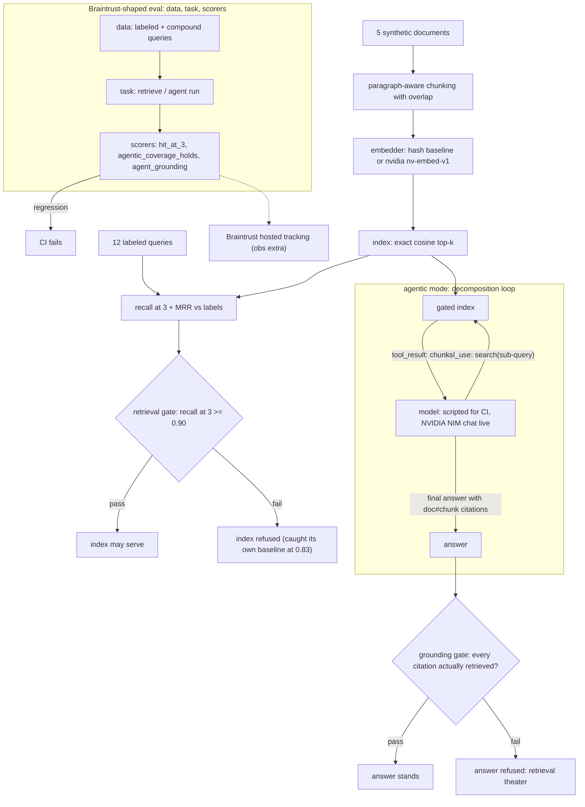

# rag-gate

[](https://github.com/jbisaccia-9/rag-gate/actions) · [captured results](RESULTS.md)

**A RAG index must pass a retrieval gate before it is allowed to serve.**

An index that cannot find the right document is not a knowledge base — it is a
random-quote generator with confidence. This repo builds a small
retrieval pipeline with no framework (paragraph-aware chunking with overlap,
pluggable embedders, exact cosine top-k in plain Python) and refuses to let an
index serve until it clears **recall@3 ≥ 0.90** on a hand-labeled query set.

The gate has already earned its keep once, on this repo's own baseline: the
first bag-of-words embedder shipped without stopword removal and **failed the
gate at recall 0.83** — function words dominated the cosine and every query
drifted toward the longest document. The fix brought it to 1.00 on the current
set. That history is the pitch: the gate caught a real retrieval defect before
anything served.

Part of the *-gate* family — see [github.com/jbisaccia-9](https://github.com/jbisaccia-9)
for the full set. One thesis: nothing ships until it passes a gate.

## The flow



## Eval structure (Braintrust-shaped)

`python -m raggate suite` runs the `Eval(data, task, scores)` contract
keyless: `hit_at_3` over the labeled queries, `agentic_coverage_holds` (the
agent may never cover less than single-shot), and `agent_grounding`. Any
regression fails CI; the obs extra pushes the identical suite to hosted
Braintrust.

## Origin

This pipeline began as my assessment work for the **NVIDIA DLI "Building RAG
Agents with LLMs"** certificate (arXiv corpus → `nv-embed-v1` embeddings →
aggregated FAISS docstore). This repo is a from-scratch rebuild of the same
shape — my code, no courseware, no frameworks — with the evaluation discipline
the course version lacked. The `nvidia` embedder mode calls the same
`nv-embed-v1` model the original was built on (stdlib HTTP, `NVIDIA_API_KEY`).

## Embedders

| mode | what it is | needs key |
|---|---|---|
| `hash` | deterministic bag-of-words baseline (feature hashing, stopword-filtered) | no |
| `nvidia` | `nvidia/nv-embed-v1` via the NIM embeddings API | yes |

| embedder | recall@3 | MRR | gate |
|---|---|---|---|
| hash-bow (keyless baseline) | 1.00 | 0.9583 | passed |
| nvidia/nv-embed-v1 (live, recorded) | 1.00 | 0.9583 | passed |

The corpus is five short synthetic documents on deliberately distinct topics;
the 12 labeled queries include paraphrase cases with minimal keyword overlap.
The measured finding: **both embedders score identically** — the labeled set
is saturated and cannot discriminate a semantic embedder from bag-of-words at
this corpus size. That is not a success story, it is the next work item:
growing the corpus and adding stemming-resistant paraphrases where
`nv-embed-v1` should pull ahead is the roadmap, and the harness is the
instrument that will show it.

## Agentic mode

`python -m raggate agent` runs a real tool-calling loop: the model is handed a
`search` tool and decomposes compound questions ("X and Y") into sub-queries —
query decomposition, the simplest genuinely agentic retrieval pattern. Backends
share one loop: a scripted decomposition policy for keyless CI (its answer is
composed from the chunks it actually retrieved), and NVIDIA NIM tool-calling
chat completions as the live path (`NVIDIA_CHAT_MODEL`, default
llama-3.3-70b-instruct).

The agent's answer faces its own gate: **grounding** — every `[doc#chunk]`
citation must be a chunk retrieved this run. CI asserts a deliberately
hallucinating backend is refused (`! python -m raggate agent hallucinating`).

The measured comparison, reported as measured: on compound questions spanning
two documents, **single-shot covers 4/4 and agentic covers 4/4 — a tie.** The
corpus is too small for decomposition to show an advantage (five distinct docs,
~2 chunks each; even a mixed embedding's top-3 spans both topics). Same
saturation the embedder comparison found, same conclusion: the instrumentation
is ready, the corpus is the roadmap. What the agentic mode demonstrably adds
today is the loop mechanics and the grounding gate.

## Quickstart

```
python -m venv .venv
.venv/bin/pip install -U pip
.venv/bin/pip install -e ".[dev]"
.venv/bin/python -m pytest -q
.venv/bin/python -m raggate gate hash
.venv/bin/python -m raggate agent
```

With `NVIDIA_API_KEY` set: `python -m raggate gate nvidia`.

MIT license.
